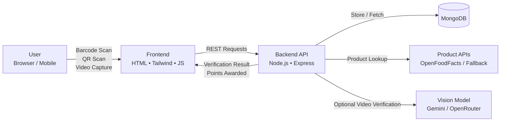

# ClearCycle

ClearCycle is a full-stack sustainability application built at **HoyaHacks 2026** that incentivizes proper waste disposal through verification and rewards. Users scan a product barcode, scan a trash can QR code, and record a short video of disposal. Once verified, the system awards points that can be redeemed for rewards.

The project focuses on accountability, accessibility, and scalability in recycling infrastructure.

### Website Link:  https://banners-exposure-closes-genre.trycloudflare.com/
---

## Architecture


## Project Goals

- Encourage correct disposal of recyclable items  
- Provide verifiable proof of disposal  
- Create a scalable system for public recycling programs  
- Reduce contamination in recycling streams  

---

## Features

- Product barcode scanning and identification  
- QR-coded trash can system  
- Short video capture for disposal verification  
- AI-assisted video validation workflow  
- User points and reward tracking  
- Admin dashboard for trash can creation and QR code downloads  
- MongoDB-backed data storage  

---

## Tech Stack

### Frontend
- HTML
- Tailwind CSS
- Vanilla JavaScript
- ZXing (barcode scanning)
- Device camera access

### Backend
- Node.js
- Express.js
- MongoDB with Mongoose
- Multer (video uploads)

### APIs / Services
- OpenFoodFacts API (primary product lookup)
- Fallback barcode search API
- Optional Gemini / OpenRouter vision models

---

## Application Flow

1. User scans a product barcode  
2. Product information is retrieved and cached  
3. User scans a trash can QR code  
4. User records a short disposal video  
5. Backend validates the sequence and stores the event  
6. Points are awarded upon successful verification  

---

## Local Setup

### Requirements
- Node.js 18+
- MongoDB (local or Atlas)
- Modern browser with camera access

### Backend Setup
```bash
cd backend
npm install
cp .env.example .env
# Add your MongoDB URI and API keys
node server.js
```

### Frontend Setup
```bash
cd public
npm install
node server.js
```
Open http://127.0.0.1:3000 in your browser.

### Environment Variables
Create a backend/.env file with the following:
```bash
MONGO_URI=mongodb://localhost:27017/clearcycle
OPENROUTER_API_KEY=your_key_here
OPENROUTER_MODEL=optional_model_name
```
Vision model keys are only required if AI verification is enabled.

## API Endpoints

### Products
- `GET /api/product?barcode=`  
  Retrieves product info and caches it in the database.

- `POST /api/product`  
  Manually adds or updates a product.

---

### Recycling Sessions
- `POST /api/recycle/session/start`  
  Starts a recycling session.

- `POST /api/recycle/session/:id/product`  
  Attaches a product to a session.

- `POST /api/recycle/session/:id/bin`  
  Attaches a trash can to a session.

- `POST /api/recycle/session/:id/video`  
  Uploads the disposal video.

---

## Database Collections

- `users` — user profiles and point totals  
- `products` — cached barcode-product mappings  
- `recycleEvents` — verified disposal events  

---

## Security Notes

- `.env` files are excluded via `.gitignore`  
- API keys are never committed to version control  
- Each developer must supply their own environment variables  

---

## Limitations and Future Work

- Improve vision model accuracy and confidence scoring  
- Add real-time reward redemption partnerships  
- Expand admin analytics and reporting  
- Support multi-material disposal detection  
